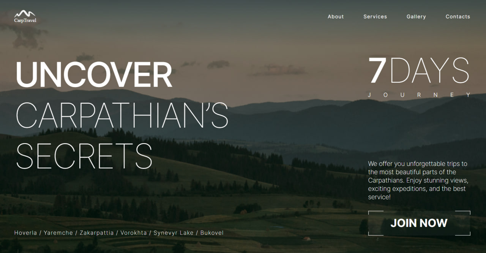
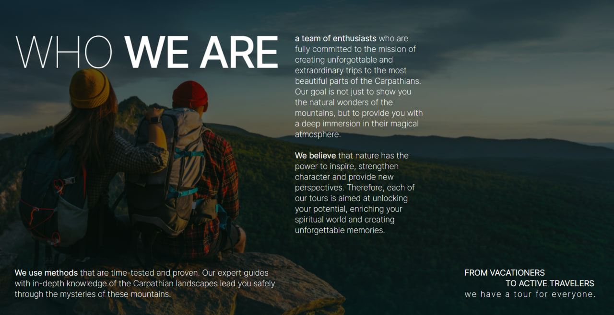
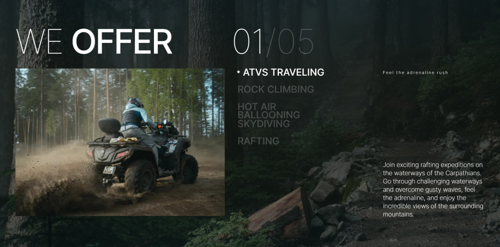
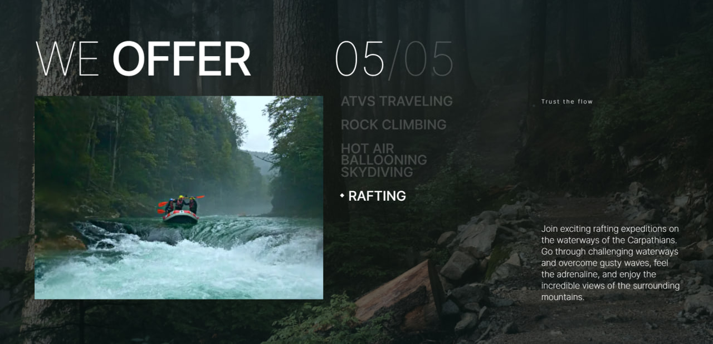
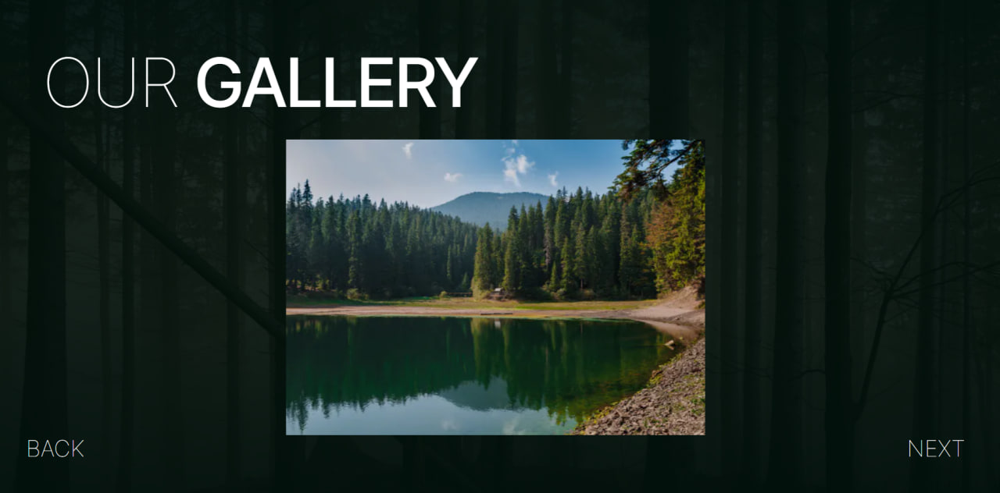
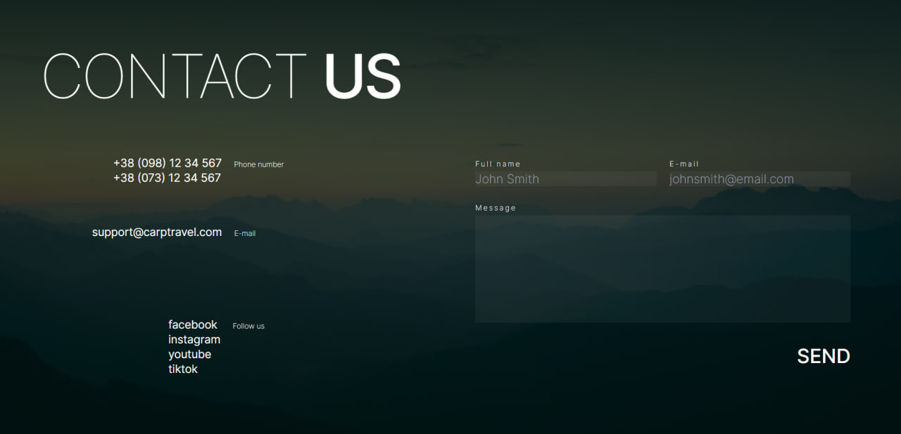

## CarpTravel

This project bootstrapped with [`create-next-app`](https://github.com/vercel/next.js/tree/canary/packages/create-next-app).

This project offers you unforgettable and extraordinary trips to the most beautiful parts of the Carpathians: Hoverla, Yaremche, Zakarpattia, Vorokhta, Synevyr Lake, Bukovel.
The project goal is not just to show you the natural wonders of the mountains, but to provide you with a deep immersion in their magical atmosphere.
Each of tours is aimed at unlocking your potential, enriching your spiritual world and creating
unforgettable memories.

The navigation menu contains the sections available on the landing page. When clicking on the corresponding item, smooth scrolling to the corresponding section occurs. React-scroll is used for smooth navigation through sections.

React-hook-form is used for form validation and Tailwind CSS is used for style validation errors.

Swiper is used in the Gallery and Services sections.

An infinite slider is implemented in the Gallery section (on tablet and desktop). You can change the slide by clicking the buttons or by dragging.

In the Service section, the appearance of the picture is implemented using the Fade effect. You can change the slide by clicking on the element.

The markup is adaptive - mobile from 320px, tablet from 768px, desktop from 1440px.
Mobile first approach is used.

Tailwind CSS was used for styling.

  
  
  
  
  
  

